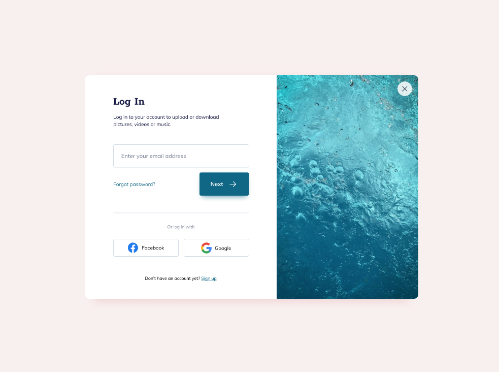
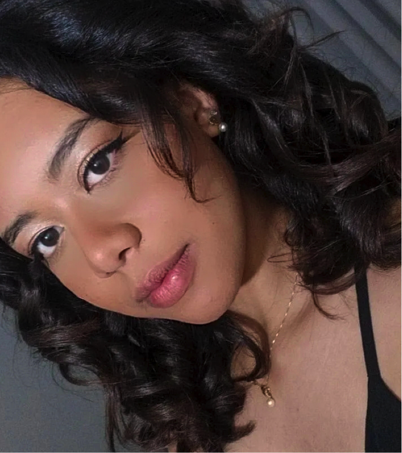

# Interfaces WEB 

# Sobre o Projeto

Projeto proposto pelo professor Diego no intuito de testar nosso aprendizado que adiquirimos através dele durante todo semestre: desenvolvimento de interface utilzando o html, css no aplicativo Visual Code

<h4 align="center"> 
	🚧  Finalizado
</h4>

# Índice/Sumário

* [Sobre](#sobre-o-projeto)
* [Sumário](#índice/sumário)
* [Requisitos Funcionais](#requisitos-funcionais)
* [Tecnologias Usadas](#tecnologias-usadas)
* [Contribuição](#contribuição)
* [Autores](#autores)
* [Licença](#licença)
* [Agradecimentos](#agradecimentos)

# Requisitos Funcionais

- [x] **Botões de login com Facebook e Google.**
- [x] **Formulário para colocar e-mail.**
- [x] **Link para se cadastrar.**
- [x] **Botão para envio do e-mail.**
- [x] **Botão para fechar o modal.**

# Tecnologias Usadas

- [HTML](https://developer.mozilla.org/pt-BR/docs/Web/HTML)
- [CSS](https://developer.mozilla.org/pt-BR/docs/Web/CSS)

# Contribuição

Leia o arquivo [CONTRIBUTING.md](CONTRIBUTING.md) para saber detalhes sobre o nosso código de conduta e o processo de envio de solicitações *pull* (*Pull Request*) para nós.

# Autores

<table>
  <tbody>
    <tr>
    <td align="center">
	  	<a href="https://kentcdodds.com">
			
			 
			<b>Esther G. P. /b>
		</a>
		 
		<a href="https://github.com/testing-library/react-testing-library/commits?author=kentcdodds" title="Code">💻</a>
	</td>
    </tr>
	</tbody>
<table>

# Licença

Este projeto está licenciado sob a Licença MIT,  consulte o arquivo [LICENSE.md](LICENSE.md) para mais detalhes.

# Agradecimentos

Gostaria de deixar meu agradecimento e gratidão ao meu professor Diego Augusto, por todas as aulas e dedicação em ensianr a turma da melhor forma possível sempre com um sorriso no rosto! 
